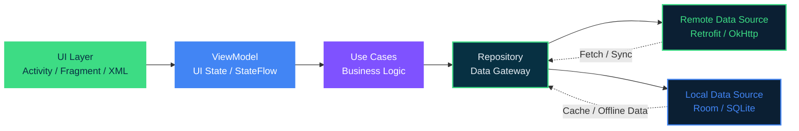

 

### Hello, World! I'm **Ibrahim Awad**

**Android Developer · Gaza City, Palestine**

 

 

---

## About Me

Android Developer with practical experience in building clean, reliable, and maintainable mobile applications using **Kotlin** and **Java**.

I work with **Android SDK**, **MVVM architecture**, **Firebase**, **Room Database**, **Retrofit**, **Coroutines**, **Flow**, **Media3**, **FFmpegKit**, and **Google Maps**.

I also have a **Cybersecurity Engineering** background, which helps me build more security-aware and reliable Android solutions.

Interested in building real-world Android applications, improving app architecture, and contributing to clean and scalable mobile projects.

 

> **My engineering philosophy:** _Good Android apps are not just screens — they are reliable and secure systems._  
> As an Android developer with a cybersecurity mindset, I focus on building mobile applications with clean architecture, readable code, secure data handling, smooth performance, and real-world reliability.

 

---

## What I Work With

| Area | Technologies and Concepts |
| :--: | :-- |
| **Native Android** | Kotlin, Java, Android SDK, XML |
| **Architecture** | MVVM, Clean Architecture, Clean Code, Maintainable App Structure |
| **Android Jetpack** | ViewModel, LiveData, Navigation Component |
| **Android Components** | Services, Broadcast Receivers, Content Providers |
| **Networking** | REST APIs, Retrofit, OkHttp |
| **Local Storage** | Room Database, SQLite, Offline Storage |
| **Async Programming** | Kotlin Coroutines, Flow, StateFlow |
| **Firebase** | Authentication, Realtime Database, Firestore, FCM |
| **Storage and Files** | Internal Storage, External Storage, Media Access, Content URIs |
| **Maps and Location** | Google Maps, GPS, Location Services |
| **Media Tools** | FFmpeg, FFmpegKit, Media3 ExoPlayer, Video Processing, Playback |
| **Debugging** | Logcat, Android Debugger, Problem Solving |

 

---
## How I Structure Android Apps

 

---

## Tech Stack

  

 

---

## Featured Projects

<table>
<tr>
<td width="33%" align="center" valign="top">

### 🎬 MediaToolKit App

**A native Android media processing app focused on video selection, preview, trimming, and local history tracking.**

Built with a clean and maintainable Android structure, using modern media handling, playback, background processing, and local data persistence.

 

  

</td>
<td width="33%" align="center" valign="top">

### 🚚 Gas Delivery User App

**A customer-side Android application for requesting gas delivery services and tracking delivery-related interactions.**

The app focuses on service requests, customer experience, location-based features, Firebase integration, and real-world ordering flow.

 

  

</td>
<td width="33%" align="center" valign="top">

### 🛠️ Gas Delivery Manager App

**A manager-side Android application for handling gas delivery requests and managing service operations.**

Designed to support order review, request management, delivery workflow control, Firebase-based data handling, and communication between customers and service providers.

 

  

</td>
</tr>
</table>

 

---

---

## Education

| Degree | Institution | Date |
| :--: | :-- | :--: |
| **Bachelor’s Degree in Cybersecurity Engineering** | University College of Applied Sciences | Expected Dec 2026 |
| **Diploma in Mobile Development** | University College of Applied Sciences | Jun 2021 |

 

---

## GitHub Stats

 

---

## Let's Connect

I'm open to **Android Developer opportunities**, **freelance projects**, and **technical collaboration**.

**LinkedIn:** [Ibrahim Awad](https://www.linkedin.com/in/ibrahim-awad-devsecx/)  
**Email:** [ibrahim.devsecx@outlook.com](mailto:ibrahim.devsecx@outlook.com)

---

  <em>"First, solve the problem. Then, write the code." — John Johnson</em>

